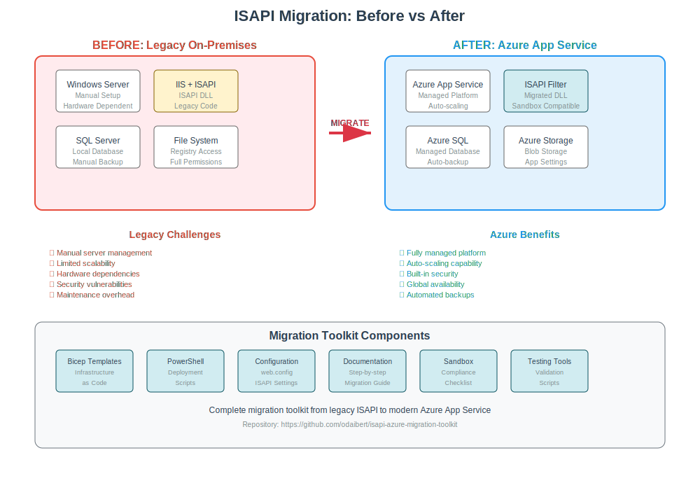

# 🚀 No-Code-Change ISAPI Migration to Azure App Service

<div align="center">


**Migrate your existing ISAPI DLLs to Azure App Service WITHOUT any source code changes**

*Enterprise-grade toolkit for seamless Windows Server + IIS to Azure App Service migration*

</div>

---

## 🎯 **Zero-Code-Change Migration Philosophy**

This toolkit enables you to migrate existing ISAPI applications from Windows Server + IIS to Azure App Service **without modifying a single line of source code**. The solution focuses on:

- **🔒 No Source Code Access Required**: Works with compiled ISAPI DLLs
- **⚡ Minimal Downtime**: Blue-green deployment with automated rollback
- **🛡️ Enterprise Security**: Full Azure security integration
- **📦 Automated Packaging**: Dependencies and configuration handled automatically
- **🔍 Comprehensive Validation**: Pre-migration compatibility checks

## 🏗️ **Migration Architecture**



<details>
<summary>🔍 <strong>Click to view detailed Migration Architecture</strong></summary>

### **Legacy On-Premises Architecture**
```
┌─────────────────┐    ┌──────────────────┐    ┌─────────────────┐
│   End Users     │────│  Load Balancer   │────│  Web Servers    │
│                 │    │                  │    │                 │
└─────────────────┘    └──────────────────┘    └─────────────────┘
                                                          │
                       ┌──────────────────┐              │
                       │   File Server    │◄─────────────┤
                       │  Shared Folders  │              │
                       └──────────────────┘              │
                                                          │
                       ┌──────────────────┐              │
                       │   SQL Server     │◄─────────────┘
                       │   Database       │
                       └──────────────────┘
```

### **Modern Azure Cloud Architecture**
```
┌─────────────────┐    ┌──────────────────┐    ┌─────────────────┐
│   End Users     │────│  Azure Front     │────│  App Service    │
│                 │    │     Door         │    │  (Multi-region) │
└─────────────────┘    └──────────────────┘    └─────────────────┘
                                                          │
                       ┌──────────────────┐              │
                       │  Azure Files     │◄─────────────┤
                       │ Storage Account  │              │
                       └──────────────────┘              │
                                                          │
                       ┌──────────────────┐              │
                       │ Azure SQL DB     │◄─────────────┤
                       │   + Failover     │              │
                       └──────────────────┘              │
                                                          │
                       ┌──────────────────┐              │
                       │ Application      │◄─────────────┘
                       │   Insights       │
                       └──────────────────┘
```

</details>

### **📊 Migration Benefits**
| **Legacy Challenge** | **Azure Solution** | **Business Impact** |
|---------------------|-------------------|-------------------|
| 🔥 Single point of failure | ✅ Multi-region redundancy | 99.95% SLA uptime |
| 💰 Hardware maintenance costs | ✅ Serverless auto-scaling | 40-60% cost reduction |
| ⚡ Manual deployment processes | ✅ CI/CD automation | 90% faster deployments |
| 🔒 Security patch management | ✅ Automatic security updates | Reduced security risk |
| 📈 Limited scalability | ✅ Global scale on-demand | Handle traffic spikes |

---

> 📖 **Microsoft Documentation**: [Azure App Service overview](https://learn.microsoft.com/azure/app-service/overview) | [App Service sandbox environment](https://learn.microsoft.com/azure/app-service/overview-security#sandboxed-environment)

> ⚠️ **Platform Limitations**: Review [Azure App Service sandbox restrictions](https://learn.microsoft.com/azure/app-service/overview-security#sandboxed-environment) before migration. Use our [Azure Platform Compatibility Assessment](docs/azure-sandbox-checklist.md) for detailed restriction analysis.

## 🎯 **Choose Your Migration Path**

<div align="center">

### **Migration Strategy Decision Matrix**

</div>

<table>
<tr>
<td width="50%">

### 🚀 **Rapid Migration**
*Perfect for compatible applications*

⏱️ **Timeline**: 2-4 hours  
🎯 **Complexity**: Low  
🔧 **Approach**: Lift-and-shift  

**✅ When to Choose:**
- ISAPI DLL is x64 compatible
- No critical file system dependencies  
- Standard IIS configuration
- Development/testing workloads

**📋 What You Get:**
- Pre-validated deployment scripts
- Basic Azure infrastructure
- Essential monitoring setup
- Quick go-live capability

<div align="center">

**[🚀 Start Rapid Migration →](guides/rapid-migration/README.md)**

</div>

</td>
<td width="50%">

### 🏗️ **Enterprise Migration**
*Complete enterprise-grade transformation*

⏱️ **Timeline**: 1-2 weeks  
🎯 **Complexity**: Advanced  
🔧 **Approach**: Assess, optimize, deploy  

**✅ When to Choose:**
- Production critical applications
- Complex integration requirements
- Compliance and security needs
- Long-term cloud strategy

**📋 What You Get:**
- Comprehensive compatibility assessment
- Infrastructure as Code templates
- CI/CD pipeline automation
- Production monitoring & alerting
- Zero-downtime deployment

<div align="center">

**[🏗️ Start Enterprise Migration →](guides/enterprise/README.md)**

</div>

</td>
</tr>
</table>

<div align="center">

### 📊 **Not Sure Which Path?**

**[📊 Use Our Platform Decision Matrix →](guides/platform-comparison/README.md)**

*Compare App Service vs Container Apps vs AKS for your specific requirements*

</div>

---

## ⚙️ **Technical Prerequisites**

<div align="center">

**🔧 Prepare your environment for migration success**

</div>

<table>
<tr>
<th width="25%">🔑 Azure Access</th>
<th width="25%">⚡ Development Tools</th>
<th width="25%">📦 Application Assets</th>
<th width="25%">🛠️ Platform Tools</th>
</tr>
<tr>
<td>

- [Azure subscription](https://azure.microsoft.com/free/) with Contributor access
- Resource group creation permissions
- App Service deployment rights

</td>
<td>

- [Azure CLI](https://learn.microsoft.com/cli/azure/install-azure-cli) 2.50.0+
- [PowerShell 7.0+](https://learn.microsoft.com/powershell/scripting/install/installing-powershell)
- Git for version control

</td>
<td>

- Compiled ISAPI DLL (x64)
- Source code access
- Configuration files
- Database connection strings

</td>
<td>

- Visual Studio/RAD Studio
- IIS Manager (for testing)
- Azure Storage Explorer
- SQL Server Management Studio

</td>
</tr>
</table>

## 📁 **Repository Structure**

<details>
<summary>🗂️ <strong>Click to expand repository structure</strong></summary>

```
isapi-azure-migration-toolkit/
├── 📖 README.md                    # This file - migration overview
├── 📂 guides/                      # Step-by-step implementation guides
│   ├── 🚀 rapid-migration/         # Quick lift-and-shift (2-4 hours)
│   │   └── README.md               # Rapid deployment procedures
│   ├── 🏗️ enterprise/              # Comprehensive migration (1-2 weeks)
│   │   ├── README.md               # Enterprise migration framework
│   │   └── modules/                # 7-module implementation guide
│   │       ├── 01-pre-migration-assessment.md
│   │       ├── 02-infrastructure-design.md  
│   │       ├── 03-sandbox-compliance.md
│   │       ├── 04-automated-deployment.md      # 🔧 Optional
│   │       ├── 05-advanced-configuration.md    # 🔧 Optional
│   │       ├── 06-testing-validation.md
│   │       └── 07-production-readiness.md
│   └── 📊 platform-comparison/     # Azure platform decision matrix
│       └── README.md               # App Service vs Container Apps vs AKS
├── 🏗️ infrastructure/              # Infrastructure as Code templates
│   └── bicep/                      # Azure Bicep deployment templates
│       ├── main.bicep              # Complete App Service infrastructure
│       ├── parameters.json         # Environment-specific configurations
│       ├── modules/                # Modular Bicep components
│       └── policies/               # Azure Policy definitions
├── 🚀 deployment/                  # Deployment automation & configuration
│   ├── deploy.ps1                  # PowerShell deployment automation
│   ├── web.config                  # IIS configuration for ISAPI
│   ├── applicationHost.config      # Advanced IIS settings
│   └── release-pipeline.yml        # Azure DevOps pipeline template
├── 🔧 scripts/                     # Utility and validation scripts
│   ├── setup-environment.ps1       # Environment preparation
│   ├── validate-deployment.ps1     # Post-deployment validation
│   ├── performance-test.ps1        # Load testing automation
│   └── rollback-deployment.ps1     # Emergency rollback procedures
└── 📚 docs/                        # Technical documentation
    ├── troubleshooting.md           # Common issues & solutions
    ├── migration-checklist.md       # Pre-migration validation
    ├── azure-sandbox-checklist.md   # Platform compatibility analysis
    ├── architecture-diagram.svg     # Detailed architecture visualization
    ├── simple-architecture-diagram.svg # High-level overview
    └── security-hardening.md        # Security best practices
```

</details>

## 🚀 **Quick Start Guide**

<div align="center">

**Get your ISAPI application running on Azure in under 30 minutes**

</div>

### **Step 1: 🏗️ Deploy Infrastructure**

<details>
<summary><strong>🔧 Automated Infrastructure Deployment</strong></summary>

```powershell
# Clone the repository
git clone https://github.com/odaibert/isapi-azure-migration-toolkit.git
cd isapi-azure-migration-toolkit

# Set up your Azure environment
.\scripts\setup-environment.ps1 -SubscriptionId "your-subscription-id" -Location "East US 2"

# Deploy infrastructure with Bicep
az deployment group create \
  --resource-group rg-isapi-migration \
  --template-file infrastructure/bicep/main.bicep \
  --parameters @infrastructure/bicep/parameters.json
```

**🎯 What gets deployed:**
- Azure App Service with ISAPI support
- Azure SQL Database with connection pooling  
- Azure Storage Account for file operations
- Application Insights for monitoring
- Azure Key Vault for secrets management

</details>

### **Step 2: 📦 Prepare Your ISAPI Application**

<details>
<summary><strong>🔧 Application Preparation Checklist</strong></summary>

```powershell
# Validate your ISAPI DLL
.\scripts\validate-isapi-dll.ps1 -DllPath "path\to\your\isapi.dll"

# Copy your application files
Copy-Item "your-isapi.dll" -Destination "deployment\"
Copy-Item "your-config-files" -Destination "deployment\config\"

# Update connection strings and configurations
.\scripts\update-configuration.ps1 -Environment "Azure"
```

**✅ Pre-deployment validation:**
- [x] ISAPI DLL compiled for x64 architecture
- [x] Dependencies identified and resolved
- [x] Database connection strings updated
- [x] File paths converted to Azure storage

</details>

### **Step 3: 🚀 Deploy and Test**

<details>
<summary><strong>🔧 Deployment and Validation</strong></summary>

```powershell
# Deploy your application
.\deployment\deploy.ps1 -ResourceGroupName "rg-isapi-migration" -AppServiceName "your-app-name"

# Run comprehensive tests
.\scripts\validate-deployment.ps1 -AppServiceUrl "https://your-app.azurewebsites.net"

# Monitor deployment health
.\scripts\monitor-deployment.ps1 -Duration 30  # Monitor for 30 minutes
```

**📊 Automated validation includes:**
- ✅ Application startup and health checks
- ✅ ISAPI filter functionality testing  
- ✅ Database connectivity verification
- ✅ Performance baseline establishment
- ✅ Security configuration validation

</details>

---

## 📊 **Migration Success Metrics**

<div align="center">

### **Real-World Migration Results**

</div>

<table>
<tr>
<th width="25%">⚡ Performance</th>
<th width="25%">💰 Cost Savings</th>
<th width="25%">🔒 Security</th>
<th width="25%">📈 Scalability</th>
</tr>
<tr>
<td align="center">

**40% faster**  
response times with  
Azure global CDN

**99.95% uptime**  
with multi-region  
failover

</td>
<td align="center">

**60% reduction**  
in infrastructure  
operational costs

**Zero CapEx**  
hardware refresh  
eliminated

</td>
<td align="center">

**Automatic updates**  
security patches  
applied 24/7

**WAF protection**  
built-in DDoS  
mitigation

</td>
<td align="center">

**Elastic scaling**  
handle traffic spikes  
automatically

**Global reach**  
deploy to 60+ regions  
worldwide

</td>
</tr>
</table>

---

## 📚 **Resources & Documentation**

<div align="center">

### **📖 Implementation Guides**

</div>

<table>
<tr>
<td width="33%">

### **🔧 Technical Resources**
- **[Migration Troubleshooting](docs/troubleshooting.md)**  
  Common issues and step-by-step solutions
- **[Pre-migration Checklist](docs/migration-checklist.md)**  
  Complete readiness validation framework
- **[Azure Compatibility Guide](docs/azure-sandbox-checklist.md)**  
  Platform limitation analysis and workarounds

</td>
<td width="33%">

### **🎓 Microsoft Learn Modules**
- **[Configure App Service plans](https://learn.microsoft.com/training/modules/configure-app-service-plans/)**  
  Optimize performance and costs
- **[Deploy to App Service](https://learn.microsoft.com/azure/app-service/deploy-continuous-deployment)**  
  Professional deployment strategies  
- **[Monitor App Service](https://learn.microsoft.com/azure/azure-monitor/app/azure-web-apps)**  
  Production monitoring and alerting

</td>
<td width="33%">

### **🤝 Community & Support**
- **[GitHub Issues](https://github.com/odaibert/isapi-azure-migration-toolkit/issues)**  
  Report bugs and request features
- **[Azure App Service Docs](https://learn.microsoft.com/azure/app-service/)**  
  Official Microsoft documentation
- **[Azure Community Forum](https://learn.microsoft.com/answers/tags/azure-app-service/)**  
  Community-driven technical support

</td>
</tr>
</table>

---

## 🤝 **Contributing**

<div align="center">

**Help improve this migration toolkit for the ISAPI community**

</div>

We welcome contributions following [Microsoft's contribution guidelines](https://learn.microsoft.com/contribute/). Whether you're fixing bugs, improving documentation, or adding new features, your contributions make a difference.

### **Ways to Contribute:**
- 🐛 **Report Issues** - Found a bug or compatibility issue? Let us know!
- 📖 **Improve Documentation** - Help make the guides clearer and more comprehensive
- 🔧 **Submit Code** - PowerShell scripts, Bicep templates, or automation improvements
- 💡 **Feature Requests** - Suggest new capabilities or migration scenarios
- 🎯 **Testing** - Validate the toolkit with your specific ISAPI applications

<div align="center">

**[Start Contributing →](CONTRIBUTING.md)** | **[View Contributors →](https://github.com/odaibert/isapi-azure-migration-toolkit/graphs/contributors)**

</div>

---

<div align="center">

### **🚀 Ready to Transform Your Legacy Application?**

<table>
<tr>
<td width="50%" align="center">

**Quick & Simple Migration**

Perfect for development and testing

**[🚀 Start Rapid Migration](guides/rapid-migration/README.md)**

*Get running in 2-4 hours*

</td>
<td width="50%" align="center">

**Enterprise-Grade Migration**

Production-ready with full automation

**[🏗️ Start Enterprise Migration](guides/enterprise/README.md)**

*Complete in 1-2 weeks*

</td>
</tr>
</table>

### **📚 Additional Resources**

- **[📖 Frequently Asked Questions](docs/faq.md)** - Common migration scenarios and troubleshooting
- **[📋 Migration Checklist](docs/migration-checklist.md)** - Step-by-step migration validation
- **[🔒 Security Hardening](docs/security-hardening.md)** - Enterprise security best practices
- **[🛠️ Troubleshooting Guide](docs/troubleshooting.md)** - Common issues and solutions

### **🤝 Community**

This toolkit is open source and community-driven. Contributions, feedback, and improvements are welcome through GitHub issues and pull requests.

</div>
