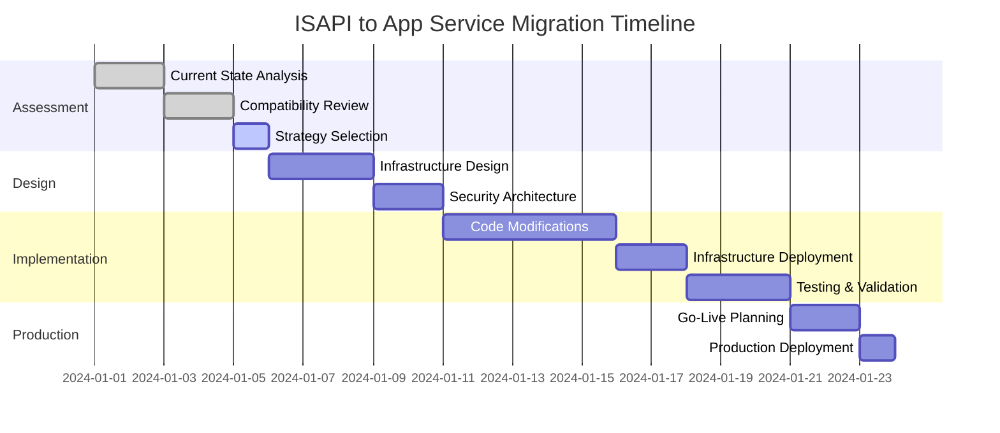

# Migration Assessment and Planning

Comprehensive pre-migration assessment framework for Delphi ISAPI applications targeting Azure App Service deployment.

**⏱️ Implementation Time**: 4-6 hours  
**👥 Team Involvement**: Developers, Solution Architects, Operations Team  
**📋 Prerequisites**: Access to ISAPI source code and production environment metrics

## Assessment Framework Overview

This module implements Microsoft's [Cloud Adoption Framework - Migrate methodology](https://learn.microsoft.com/azure/cloud-adoption-framework/migrate/), providing structured assessment of your current ISAPI architecture and Azure migration readiness.

### Assessment Deliverables

- **Current State Architecture** documentation and analysis
- **Azure Platform Compatibility** assessment report
- **Risk and Mitigation Matrix** with recommended actions
- **Migration Strategy Document** with implementation approach
- **Resource Requirements** and cost estimation

## 🔍 Current State Analysis

### ISAPI Architecture Assessment

#### Application Inventory
Document your current ISAPI implementation using this structured approach:

```powershell
# PowerShell script to analyze ISAPI configuration
param(
    [string]$WebSiteName = "Default Web Site"
)

Write-Host "=== ISAPI Filter Assessment ===" -ForegroundColor Green

# Get IIS application pools
$AppPools = Get-IISAppPool
Write-Host "`nApplication Pools:" -ForegroundColor Yellow
$AppPools | Format-Table Name, State, ProcessModel.IdentityType, ProcessModel.UserName

# Get websites and their filters
$Sites = Get-IISSite
foreach ($Site in $Sites) {
    Write-Host "`nSite: $($Site.Name)" -ForegroundColor Yellow
    $Config = Get-IISConfiguration -SectionPath "system.webServer/isapiFilters" -Location "$($Site.Name)/"
    $Filters = Get-IISConfigSection -ConfigurationElement $Config
    
    if ($Filters.ChildElements.Count -gt 0) {
        Write-Host "ISAPI Filters:" -ForegroundColor Cyan
        foreach ($Filter in $Filters.ChildElements) {
            Write-Host "  - Name: $($Filter.Attributes['name'].Value)" -ForegroundColor White
            Write-Host "    Path: $($Filter.Attributes['path'].Value)" -ForegroundColor White
            Write-Host "    Enabled: $($Filter.Attributes['enabled'].Value)" -ForegroundColor White
        }
    }
}

# Check for dependencies
Write-Host "`nDependency Analysis:" -ForegroundColor Yellow
$Dependencies = @(
    "System.Data.OleDb",
    "ADODB",
    "Registry access",
    "File system access",
    "COM components",
    "External executables"
)

foreach ($Dep in $Dependencies) {
    Write-Host "Checking for $Dep..." -ForegroundColor Cyan
    # Add specific checks based on your application
}
```

#### Technical Specification Document

Complete this assessment checklist for your ISAPI application:

**📋 Application Characteristics**
- [ ] **DLL File Size**: _______ MB
- [ ] **Framework Version**: Delphi _____ / C++ Builder _____
- [ ] **Target Architecture**: x86 / x64 / AnyCPU
- [ ] **External Dependencies**: List all COM components, third-party libraries
- [ ] **Database Connectivity**: SQL Server, Oracle, OLE DB, ODBC drivers used
- [ ] **File System Usage**: Read/Write operations, temporary files, logging

**📋 IIS Integration Points**
- [ ] **Filter Priority**: _____ (SF_NOTIFY_ORDER_HIGH/MEDIUM/LOW)
- [ ] **Event Notifications**: List all SF_NOTIFY_* events used
- [ ] **Header Manipulation**: Request/Response header modifications
- [ ] **Authentication Integration**: Custom authentication, Windows auth, certificates
- [ ] **Logging Mechanisms**: IIS logs, custom logging, event logs

### Performance Baseline Establishment

Capture current performance metrics for comparison post-migration:

```powershell
# Performance monitoring script
param(
    [int]$DurationMinutes = 60,
    [string]$OutputPath = ".\performance-baseline.csv"
)

Write-Host "Collecting performance baseline for $DurationMinutes minutes..." -ForegroundColor Green

$Counters = @(
    "\Processor(_Total)\% Processor Time",
    "\Memory\Available MBytes",
    "\Web Service(_Total)\Current Connections",
    "\Web Service(_Total)\Get Requests/sec",
    "\Web Service(_Total)\Post Requests/sec",
    "\ASP.NET Applications(__Total__)\Requests/Sec",
    "\ASP.NET Applications(__Total__)\Request Execution Time"
)

$EndTime = (Get-Date).AddMinutes($DurationMinutes)
$Results = @()

while ((Get-Date) -lt $EndTime) {
    $Timestamp = Get-Date
    $Metrics = Get-Counter -Counter $Counters -SampleInterval 30 -MaxSamples 1
    
    foreach ($Sample in $Metrics.CounterSamples) {
        $Results += [PSCustomObject]@{
            Timestamp = $Timestamp
            Counter = $Sample.Path
            Value = $Sample.CookedValue
            InstanceName = $Sample.InstanceName
        }
    }
    
    Write-Host "." -NoNewline
}

$Results | Export-Csv -Path $OutputPath -NoTypeInformation
Write-Host "`nBaseline collected: $OutputPath" -ForegroundColor Green
```

## 🎯 Azure Platform Compatibility Assessment

### App Service Capability Mapping

Evaluate your ISAPI functionality against Azure App Service capabilities:

#### ✅ **Supported Operations**
- **HTTP Request/Response Processing**: Full support with managed pipeline
- **Database Connectivity**: SQL Database, MySQL, PostgreSQL with connection pooling
- **File I/O**: Limited to application directory and temp folder
- **Environment Variables**: Full support via app settings
- **HTTPS/TLS**: Managed certificates and custom certificate support

#### ⚠️ **Limited Support Operations**
- **Registry Access**: Use app settings or Azure Key Vault instead
- **COM Components**: Limited; consider Azure Functions or container deployment
- **File System Access**: Restricted to app directory (`D:\home`)
- **Performance Counters**: Replace with Application Insights metrics
- **Event Logs**: Implement application logging to Azure Monitor

#### ❌ **Unsupported Operations**
- **Windows Services**: Use Azure Functions or Service Bus instead
- **System-wide Registry**: Migrate configuration to app settings
- **Kernel-mode Operations**: Not supported in App Service sandbox
- **Hardware Access**: Use IoT Hub or cloud APIs for hardware integration

### Migration Complexity Matrix

Assess migration complexity using this framework:

| Component | Complexity | Effort | Recommendation |
|-----------|------------|--------|----------------|
| HTTP Processing | **Low** | 1-2 days | Direct migration with minimal changes |
| Database Access | **Medium** | 2-5 days | Update connection strings, implement retry logic |
| File Operations | **High** | 5-10 days | Refactor to use Azure Storage or app directory |
| COM Dependencies | **High** | 10+ days | Consider rewriting or using Azure Functions |
| Registry Usage | **Medium** | 3-7 days | Migrate to app settings or Key Vault |

### Risk Assessment Framework

#### **High Risk Factors** (Migration Blockers)
- [ ] **Kernel-mode Operations**: Requires architecture redesign
- [ ] **Hardware Dependencies**: Cannot be migrated to App Service
- [ ] **Complex COM Components**: May require rewriting
- [ ] **Large File Processing**: Consider Azure Functions with storage
- [ ] **Real-time Requirements**: Evaluate Container Apps for lower latency

#### **Medium Risk Factors** (Require Modification)
- [ ] **Registry Access**: Migrate to configuration management
- [ ] **File System Dependencies**: Refactor for sandbox restrictions
- [ ] **Performance Counters**: Implement Application Insights telemetry
- [ ] **Windows Authentication**: Implement Azure AD integration
- [ ] **Legacy Database Drivers**: Update to modern connection libraries

#### **Low Risk Factors** (Minimal Changes)
- [ ] **HTTP Request Processing**: Standard migration path
- [ ] **Response Generation**: Supported with minimal changes
- [ ] **Basic File I/O**: Within app directory limitations
- [ ] **Environment Variables**: Direct mapping to app settings
- [ ] **HTTPS Handling**: Managed by App Service platform
## 📊 Migration Strategy Development

### Strategy Selection Framework

Based on your assessment results, select the optimal migration approach:

#### **Lift-and-Shift Strategy** (Low Complexity)
**When to Use**: ISAPI uses standard HTTP processing, minimal file system access, SQL Server connectivity
```
✅ Advantages: Fastest migration, minimal code changes
⚠️ Considerations: May not leverage cloud-native features
📅 Timeline: 1-2 weeks
💰 Cost: Lower development cost, standard App Service pricing
```

#### **Refactor Strategy** (Medium Complexity)
**When to Use**: ISAPI has registry dependencies, COM components, or file system requirements
```
✅ Advantages: Optimized for cloud, better performance
⚠️ Considerations: Moderate development effort required
📅 Timeline: 3-4 weeks
💰 Cost: Medium development cost, potential operational savings
```

#### **Hybrid Strategy** (High Complexity)
**When to Use**: Complex dependencies requiring multiple Azure services
```
✅ Advantages: Leverages full Azure ecosystem
⚠️ Considerations: Higher complexity, multiple service coordination
📅 Timeline: 6-8 weeks
💰 Cost: Higher initial cost, long-term operational efficiency
```

### Implementation Roadmap

Create your migration timeline using this template:



## 🔗 Integration with Platform Comparison

Based on your assessment, reference the [Platform Comparison Guide](../../platform-comparison/README.md) to validate your Azure service selection:

- **Simple HTTP Processing**: App Service recommended
- **Complex Dependencies**: Consider Azure Container Apps
- **High Performance/Control**: Evaluate Azure Kubernetes Service
- **Serverless Workloads**: Assess Azure Functions suitability

## 📋 Assessment Completion Checklist

- [ ] **Technical inventory** documented with all dependencies
- [ ] **Performance baseline** captured for comparison
- [ ] **Compatibility assessment** completed with risk categorization
- [ ] **Migration strategy** selected based on complexity analysis
- [ ] **Implementation timeline** created with resource allocation
- [ ] **Stakeholder approval** obtained for selected approach

## 📚 Reference Documentation

- [Azure App Service documentation](https://learn.microsoft.com/azure/app-service/)
- [Cloud Adoption Framework - Migrate](https://learn.microsoft.com/azure/cloud-adoption-framework/migrate/)
- [Azure Well-Architected Framework](https://learn.microsoft.com/azure/architecture/framework/)
- [App Service sandbox limitations](https://learn.microsoft.com/azure/app-service/overview-app-service-sandbox)

---

## 🚀 Next Steps

With your assessment complete, proceed to **[Module 2: Infrastructure Design](02-infrastructure-design.md)** to architect your Azure environment based on your migration strategy.

### Navigation
- **← Previous**: [Enterprise Migration Framework](../README.md)
- **→ Next**: [Infrastructure Design](02-infrastructure-design.md)
- **🔧 Troubleshooting**: [Common Assessment Issues](../../../docs/troubleshooting.md#assessment-issues)
- **Timeline**: [Detailed schedule]
- **Resources Required**: [Team/Tools/Budget]
- **Success Criteria**: [Measurable goals]

## Next Steps
1. [Immediate actions]
2. [Phase 1 activities]
3. [Key milestones]
```

## ✅ Module 1 Completion

### Knowledge Check
- [ ] I have inventoried my ISAPI filter components
- [ ] I understand Azure sandbox restrictions
- [ ] I've identified potential migration blockers
- [ ] I have a preliminary migration strategy
- [ ] I've assessed risks and effort required

### Deliverables
- [ ] **Assessment Report**: Completed migration assessment
- [ ] **Risk Matrix**: Identified high/medium/low risk items
- [ ] **Migration Plan**: Phase-by-phase approach
- [ ] **Go/No-Go Decision**: Clear recommendation

## 🔄 Next Steps

Once you've completed your assessment, proceed to:
- **[Module 2: Infrastructure Architecture](02-infrastructure-design.md)** - Design your Azure infrastructure
- **Alternative**: If assessment reveals significant issues, consult [Troubleshooting Guide](../../../docs/troubleshooting.md)

---

### 📚 Additional Resources
- [Azure App Service Limitations](https://docs.microsoft.com/azure/azure-resource-manager/management/azure-subscription-service-limits#app-service-limits)
- [Azure Web App Sandbox](https://github.com/projectkudu/kudu/wiki/Azure-Web-App-sandbox)
- [Migration Planning Best Practices](https://docs.microsoft.com/azure/architecture/cloud-adoption/migrate/)
